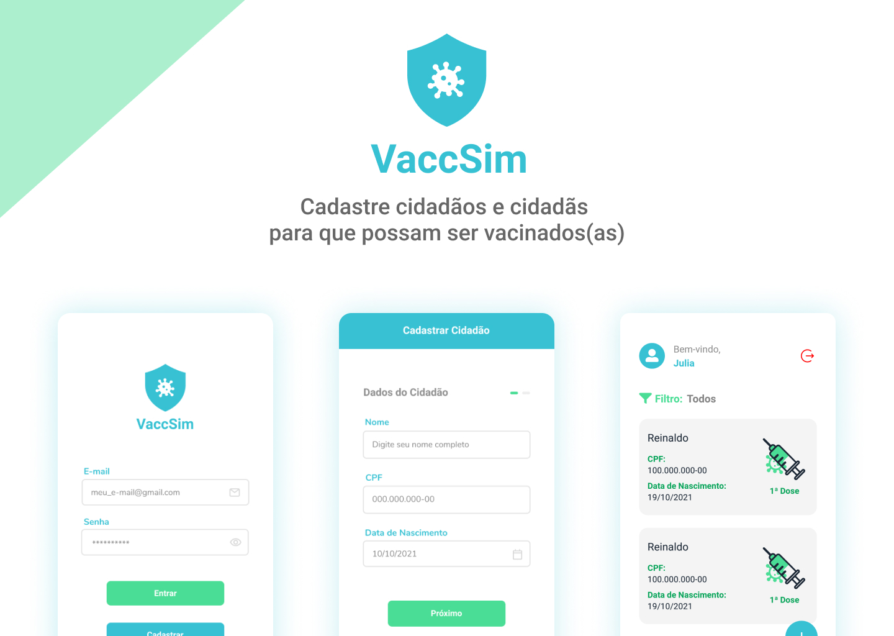

  <h1>VaccSim - React Native</h1>

  

<h2>🏆 Projeto</h2>

  Projeto criado com ênfase em requisitos necessários em 99% das aplicações dos quais se pode citar autenticação, validação de dados
  em formulários, tratativas de erro e feedback para o usuário entender que algo está sendo processado após uma determinada ação. Nesse projeto coloquei em prática diversos conceitos que desenvolvi durante minha experiência pessoal e profissional
  como programador como a validação de dados usando Yup, navegação entre telas usando a lib React Navigation, persistência de dados usando
  AsyncStorage para manter o usuário logado após fechar o app, uso da context-api para compartilhamento de estado entre a aplicação, uso de headers padrões
  em todas as requisições utilizando o cliente axios, uso de máscaras para campos de texto, uso de datas com DateTimePicker e além disso tudo, também foquei na organização e legibilidade do código para que fosse possível mantê-lo e 
  entedê-lo. De bônus ainda utilizei a versão do 6 React Navigation, a qual já possui integração com typescript para definição das rotas e de seus parâmetros, além de ter 
  encontrado uma ótima lib (react-native-modal-dropdown) customizável para trabalhar com Selects no React Native.

<h2>🎬 Preview</h2>

<h2> ⭐️ Funcionalidades</h2>
<ul>
  <li>✅ Login com validação</li>
  <li>✅ Cadastro com validação</li>
  <li>✅ Persistência de dados de usuário após fechar o app sem deslogar</li>
  <li>✅ Cadastro de cidadãos e da vacina que será aplicada</li>
  <li>✅ Listagem de cidadãos</li>
  <li>✅ Filtro de cadastro de cidadãos pelas doses da vacina</li>
</ul>

<h2> 📦 Libs </h2>
<ul>
  <li>React Native CLI</li>
  <li>TypeScript</li>
  <li>Styled-Components</li>
  <li>Context-api</li>
  <li>React Native Vector Icons</li>
  <li>React Navigation V6</li>
  <li>AsyncStorage</li>
  <li>Yup</li>
  <li>DateTimePicker</li>
  <li>React Native Modal Dropdown</li>
</ul>

